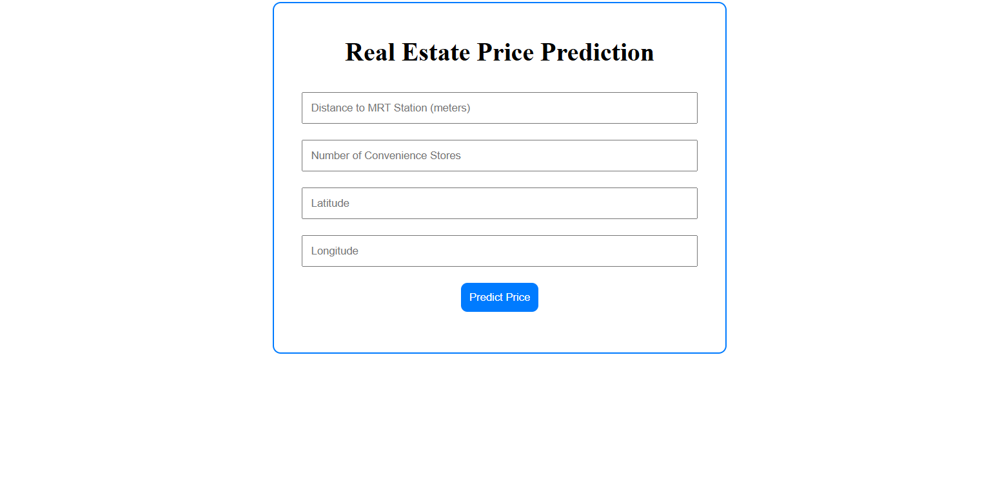

# 🏠 Real Estate Price Prediction System  

A machine learning web application built with **Python, Pandas, Scikit-Learn, Flask, and Dash** that predicts the **house price per unit area** based on location features.  

---

## ✨ Features
- 📊 Predicts real estate prices using Linear Regression  
- 🌐 Interactive web interface built with **Dash**  
- 🗂️ Uses dataset features like:  
  - Distance to MRT station (meters)  
  - Number of convenience stores  
  - Latitude & Longitude  
- 📸 Clean and simple UI  

---

## 🚀 Getting Started

### 1️⃣ Clone the Repository
```bash
git clone https://github.com/mfaiz61926/Real-Estate-Price-Prediction-system.git
cd Real-Estate-Price-Prediction-system
